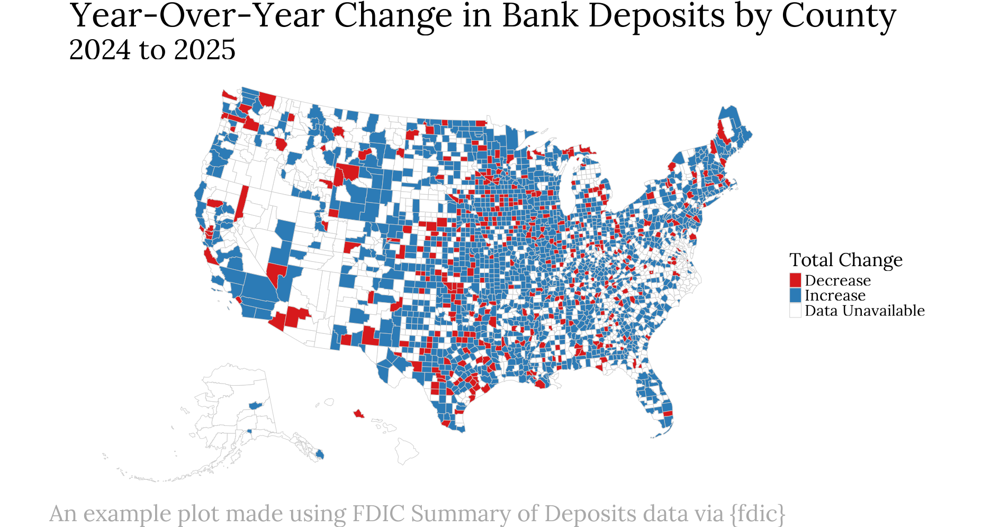

<!-- README.md is generated from README.Rmd. Please edit that file -->

```{r, include = FALSE}
knitr::opts_chunk$set(
  collapse = TRUE,
  comment = "#>",
  fig.path = "man/figures/README-",
  out.width = "100%"
)

devtools::load_all()
```

# fdic <a href="https://ketchbrookanalytics.github.io/fdic/"></a>

<!-- badges: start -->
[](https://github.com/ketchbrookanalytics/fdic/actions/workflows/R-CMD-check.yaml)
<!-- badges: end -->

R package for retrieving data from the [FDIC BankFind Suite API](https://api.fdic.gov/banks/docs/).

<br>



The FDIC BankFind Suite API allows you to:

- Search for specific FDIC-insured financial institutions
- Collect branch office location data
- Explore annual branch office deposit data by institution and location
- Review financial reports and other performance metrics for institutions
- Get details on failed financial institutions and structural change events
- Retrieve historic aggregate financial and structural data
- Obtain demographic data related to financial institutions

## Installation

You can install the development version of {fdic} from GitHub using {pak} like so:

``` r
# install.packages("pak")
pak::pak("ketchbrookanalytics/fdic")
```

## Authentication

An API key is required to use {fdic}. Register for a free personal key at the [United States Government's Open Data Portal](https://api.data.gov/signup/), which allows up to 1,000 requests per hour.

### Using Your API Key

Once you have obtained your API key, we recommend setting it as the `FDIC_API_KEY` environment variable. Perhaps the easiest way to do this is to create an `.Renviron` file at the root of your project like so:

``` .Renviron
FDIC_API_KEY=QwPoVb951753
```

*Note: the above API key is an example and will not work -- it must be replaced with a valid API key value.*

If you prefer not to set the API key as an environment variable, you can pass it directly using the `api_key` argument available in each function in {fdic}.

## Example

```{r example-1}
library(fdic)

# Search for the five largest active institutions by asset size in New York
# Collect the total asset amount, name of each institution, and the report date
# The `ID` column is included in all responses despite not being in `fields`
# Sort the results by total assets, descending
get_institutions(
  filters = "STALP:NY AND ACTIVE:1",
  fields = c("ASSET", "NAME", "REPDTE"),
  sort_by = "ASSET",
  descending = TRUE,
  limit = 5
)
```

For a more detailed walkthrough, see `vignette("fdic")`.

## Related Projects

Inspiration for {fdic} came from several existing packages (both R and Python) that wrap the FDIC BankFind Suite API, including:

- [{fdicdata}](https://github.com/Visbanking/fdicdata)
- [{fdic.api}](https://github.com/bertcarnell/fdic.api)
- [{bankfind}](https://github.com/dpguthrie/bankfind)

{fdic} expands on the principles of these packages to provide a consistent, flexible, and well-documented interface that uses a [modern HTTP client](https://httr2.r-lib.org/) and returns data in an [easily usable format](https://tibble.tidyverse.org/).

## Need Help?

If you're in need of assistance working with {fdic}, don't hesitate to reach out to our team at [info@ketchbrookanalytics.com](mailto:info@ketchbrookanalytics.com).
